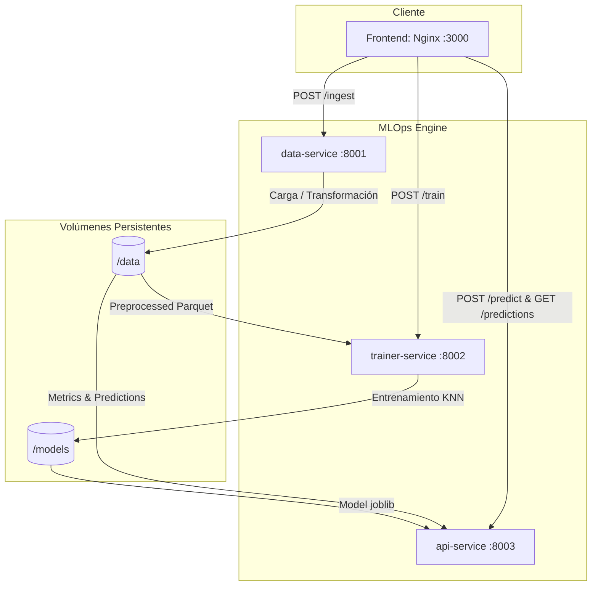

# 📘 Documentación Técnica — Plataforma ML YouTube KNN

Esta documentación técnica corta describe la arquitectura del sistema, el flujo de datos general y las instrucciones para la ejecución del pipeline del proyecto final.

---

## 1. Arquitectura del Sistema

La solución adopta una **arquitectura desacoplada en microservicios** utilizando contenedores Docker orquestados por Docker Compose. Cada contenedor representa una etapa independiente del ciclo de vida de Machine Learning (MLOps).



### Componentes y Tecnologías

1. **Frontend (`nginx:stable-alpine` — Puerto `3000`)**:
   - Interfaz web interactiva y responsiva basada en HTML5, CSS3 y Vanilla Javascript (estilo Dark Mode moderno).
   - Gestiona visualmente el estado del pipeline e interactúa directamente con los microservicios backend.

2. **Ingesta de Datos (`data-service` — Puerto `8001`)**:
   - Backend ligero en Python (FastAPI).
   - Carga el dataset original en formato CSV (`/data/global_youtube_creator_data_large.csv`), realiza limpieza y aplica transformaciones logarítmicas (`log1p`) a las características para normalizar la distribución.
   - Escribe el resultado en formato binario optimizado Parquet (`/data/preprocessed.parquet`).

3. **Entrenamiento (`trainer-service` — Puerto `8002`)**:
   - Servicio Python (FastAPI).
   - Consume el dataset preprocesado, excluye identificadores únicos no predictivos (`video_id`), divide los datos en sets de Entrenamiento (80%) y Prueba (20%), y entrena un modelo **K-Nearest Neighbors (KNN, k=5)**.
   - Exporta el modelo a `/models/youtube_model.joblib` y la lista ordenada de columnas a `/models/feature_columns.json`. Escribe métricas a `/data/metrics.json`.

4. **Inferencia y Predicción (`api-service` — Puerto `8003`)**:
   - Microservicio principal de API REST (FastAPI).
   - Consume el modelo serializado en tiempo de ejecución. Permite hacer predicciones en base a un payload JSON o extrayendo dinámicamente metadatos de la API de YouTube usando una URL de video.
   - **Persistencia de Predicciones**: Cada predicción exitosa queda registrada de forma persistente en `/data/predictions.json` (historial).

---

## 2. Flujo de Datos y Pipelines (Ciclo MLOps)

El sistema opera bajo un flujo secuencial e interactivo gatillado desde el Frontend o vía peticiones HTTP:

```
[Dataset CSV] ──► Ingestión (Log-transforms) ──► [.parquet]
                                                     │
[Métricas JSON] ◄── Entrenamiento (KNN Classifier) ◄─┘
      │
      └──► [youtube_model.joblib] ──► API de Inferencia (Predict) ──► [Predictions History JSON]
```

### Pipelines del Sistema:

1. **Pipeline de Ingesta (`POST /ingest` en `data-service`)**:
   - Carga del CSV en memoria.
   - Generación de nueva característica: $engagement\_rate = \frac{likes + comments + shares}{views + 1}$.
   - Transformación logarítmica para reducir el sesgo de escala: $x_{log} = \ln(x + 1)$ para vistas, likes, comentarios, shares y engagement rate.
   - Persistencia en `.parquet`.

2. **Pipeline de Entrenamiento (`POST /train` en `trainer-service`)**:
   - Lectura del archivo `.parquet` y remoción de variables de sesgo.
   - Codificación One-Hot para variables categóricas (`category`, `language`, `region`).
   - Split 80/20. Entrenamiento KNN.
   - Persistencia de modelo (`.joblib`), mapeo de columnas dummy (`.json`) y métricas de desempeño (`accuracy` y `f1_score`).

3. **Pipeline de Inferencia (`POST /predict` en `api-service`)**:
   - Carga el modelo bajo demanda.
   - Si recibe una URL de YouTube, consume la API pública de Google, extrae estadísticas de reproducción, aplica las transformaciones logarítmicas correspondientes y predice.
   - Si recibe un JSON de características, valida e infiere el resultado (anuncios habilitados: `1`, deshabilitados: `0`).
   - Guarda el registro con marca de tiempo en el log de historial persistente.

---

## 3. Ejecución y Despliegue del Sistema

### Requisitos Previos
- Docker y Docker Compose instalados.
- (Opcional) Una API Key de YouTube para probar la predicción directa por URL.

### Instrucciones de Despliegue

1. **Definir Variables de Entorno (Opcional)**:
   ```bash
   export YOUTUBE_API_KEY="tu-api-key-de-google"
   ```

2. **Levantar e Inicializar los Contenedores**:
   ```bash
   docker-compose up --build
   ```

3. **Interactuar**:
   - Abre **`http://localhost:3000`** en tu navegador.
   - Ejecuta la **Ingesta de Datos** (Paso 1).
   - Inicia el **Entrenamiento del Modelo** (Paso 2).
   - El sistema automáticamente recargará el nuevo modelo en la API.
   - Realiza predicciones y observa los resultados visuales y el historial persistente.
